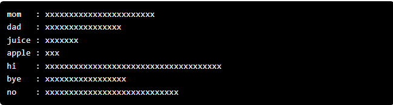

# Stanford | Code in Place 2025

## Baby Vocab

Parenthood is an exciting time with lots happening! One of the most memorable things as a parent when you have a baby is hearing them speak their first word. However, it can also be interesting to see what words your baby learns and say the most as they grow! 
 
To explore our interest in a baby's vocabulary, write a program that loops over a list of words made by a baby, counts the appearance of each word, and then makes a histogram from counts. For the histogram formatting, have the words appear vertically and the bars appear horizontally. For the bars, represent each appearance of a word with a singular 'x'. See below for an example. We've already loaded the list of words from a file for you in the starter code. Check it out if you'd like. 😀  
 
Histograms can be thought of as a chart that looks like a bunch of connected bars. Each bar represents different groups or ranges of numbers. The height of each bar shows how many things (like data points or occurrences) fall into that group. In this case, each bar will belong to a word the baby said and how tall the bar is depends on how many times the baby said that specific word.
 
When you're done, your output should look similar to this:  

 
 
In the above example, the word "mom" would have been said 23 times, "dad" would have been said 16 times, and so on.