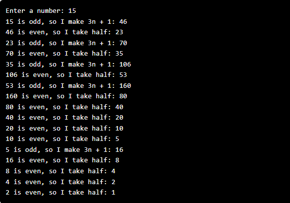

# Stanford | Code in Place 2025

## Hailstone 
 
Douglas Hofstadter’s Pulitzer-prize-winning book Gödel, Escher, Bach contains many interesting mathematical puzzles, many of which can be expressed in the form of computer programs. In Chapter XII, Hofstadter mentions a wonderful problem:

Pick some positive integer and call it n. 
If n is even, divide it by two. 
If n is odd, multiply it by three and add one. 
Continue this process until n is equal to one. 
 

 
As you can see from this example, the numbers go up and down, but eventually—at least for all numbers that have ever been tried—comes down to end in 1. In some respects, this process is reminiscent of the formation of hailstones, which get carried upward by the winds over and over again before they finally descend to the ground. Because of this analogy, this sequence of numbers is usually called the Hailstone sequence, although it goes by many other names as well. 
 
You can check if a number is even or odd using the % operator. The % operator takes the left side and divides by the right and evaluates to the integers remaining. For example 5 % 2 would return 1 since 5 divides into 2 twice, with 1 left over (remaining).  
 
The fascinating thing about this problem is that no one has yet been able to prove that it always stops. This problem (often refered to in math as the Collatz Conjecture) is one of the most famous unsolved problems in math. The number of steps in the process can certainly get very large. How many steps, for example, does your program take when n is 27? 