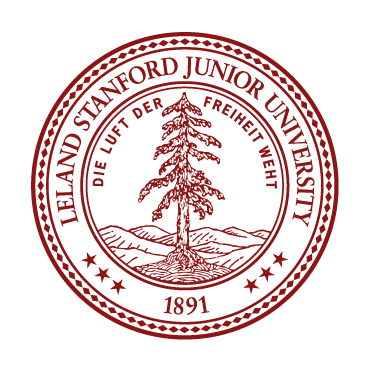
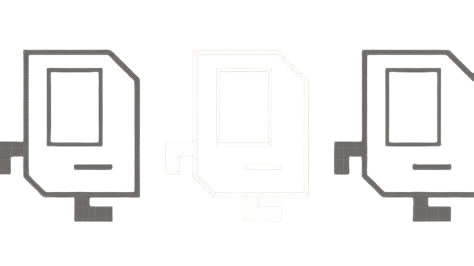

# Stanford | Code in Place 2025

**Code in Place** is a free, introductory programming course offered by Stanford University. Based on the renowned CS106A curriculum, it provides learners worldwide with the opportunity to learn Python programming in a supportive and interactive environment.

## 🧑‍🏫 Who Should Apply?

This course is designed for individuals aged 16 and above with no prior programming experience. It's ideal for:

- Beginners eager to learn coding
- Students seeking to enhance their technical skills
- Professionals considering a career shift
- Anyone interested in learning Python programming

## 📚 Course Highlights

- **Curriculum:** Based on Stanford's CS106A, covering topics like control flow, loops, conditionals, variables, graphics, lists, and dictionaries.
- **Projects:** Hands-on assignments such as building console programs and creating graphical applications.
- **Community:** Small groups (10–15 students) led by trained volunteer section leaders to foster personalized learning.
- **Global Reach:** Join a diverse community of learners from around the world.

## 📝 Syllabus

In Code in Place you will learn the fundamentals of Python programming including: control flow, loops and conditionals, console programs with variables, graphics, lists and dictionaries.

| Week               | Topic                 | You Build            | Unit     |
|--------------------|-----------------------|----------------------|----------|
| Week 1             | Control Flow with Karel | Welcome Karel       | Karel    |
| Week 2             | The Art of Coding      | Puzzle Karel         | Karel    |
| Week 3             | Console Programs       | Sandcastles          | Console  |
| Week 4             | Understanding Variables| Khansole Academy     | Console  |
| Week 5             | Graphics               | Random Art           | Graphics |
| Week 6             | Lists + Dictionaries   | World's Hardest Game  | Graphics |
| Beyond Code in Place | Continue Learning     | Final Project        | Creativity |

## 🌐 Global Impact

- **Past Offerings:** Hosted four times (2020, 2021, 2023, 2024) with over 40,000 students and 4,000 section leaders.
- **Student Satisfaction:** 99.5% of students in previous cohorts would recommend the course to a friend.
- **Diverse Participation:** Learners and instructors from various backgrounds and countries.

## 🔗 Resources

- [Official Website](https://codeinplace.stanford.edu/)
- [Information Session Video](https://www.youtube.com/watch?v=2rimv2a1o3I)
- [Reddit Discussion](https://www.reddit.com/r/learnprogramming/comments/1jm94f5/free_python_classes_stanford_university_code_in/)

## 🤖 Karel the Robot

