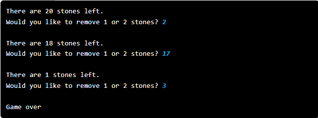
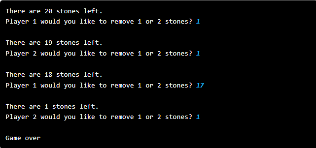
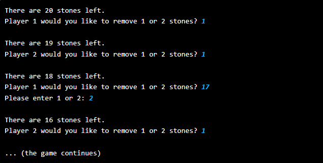
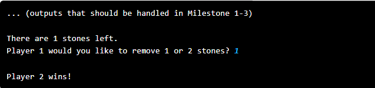

# Stanford - Code in Place 5

## The Game of Nimm

Nimm is an ancient game of strategy that is named after the old German word for "take." It is also called Tiouk Tiouk in West Africa and Tsynshidzi in China. Players alternate taking stones until there are zero left. The game of Nimm goes as follows:

1. The game starts with a pile of 20 stones between the players
2. The two players alternate turns
3. On a given turn, a player may take either 1 or 2 stone from the center pile
4. The two players continue until the center pile has run out of stones.
The last player to take a stone loses.

Write a program to play Nimm. To make your life easier we have broken the problem down into smaller milestones. You have a lot of time for this program. Take it slowly, piece by piece.

**Milestone 1**
Start with 20 stones. Repeat the process of removing stones and printing out how many stones are left until there are zero. Don't worry about whose turn it is. Don't worry about making sure only one or two stones are removed. Use the method int(input(msg)) which prints msg and waits for the user to enter a number and casts it to an integer. Add an empty print() function between removals to make  tracking turns easier. This should look like (user input is in blue):

**Milestone 2**
Create a variable of type int to keep track of whose turn it is (remember there are two players). Tell the user whose turn it is. Each time someone picks up stones, change the player number. With this, your output should now be (user input is in blue):

**Milestone 3**

Make sure that each turn only one or two stones are removed. After you read a number of stones to remove from a user (their input), you can use the following pattern to check if it was valid and keep asking until it is valid.

    while (input_is_invalid) :
        user_input = int(input("Please enter 1 or 2: "))

Now, instead of the output Milestone 2 gave you, the output should now be (user input is in blue):

**Milestone 4**
Announce the winner.

